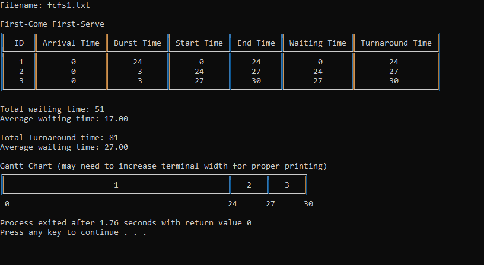
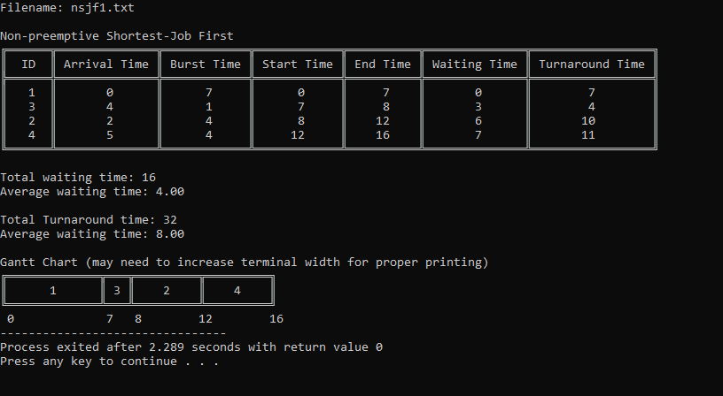
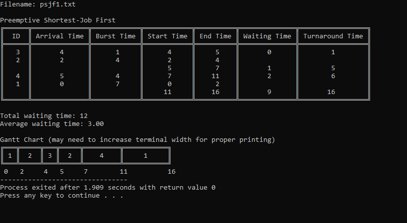
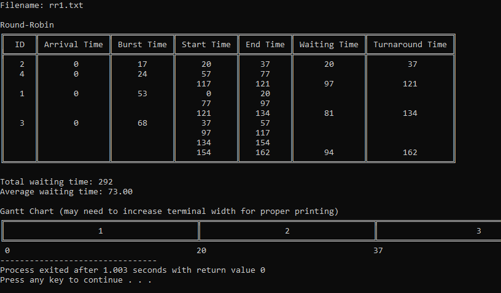

# CPU Scheduling
C program that simulates basic CPU scheduling algorithms.

## How to run
1. Using gcc compiler, run `gcc -o simulator cpu-scheduling.c` in the command line to compile the code
2. Open executable file `simulator.exe`

## Algorithms Implemented
- First-Come First-Serve (FCFS)
- Non-preemptive Shortest-Job First (NSJF)
- Preemptive Shortest-Job First (PSJF)
- Round-Robin (RR)

## Input
The program accepts the filename of an input text file which contains the following: 
- The first line contains 3 integers separated by space, 𝑋𝑌𝑍
- 𝑋 denotes the CPU scheduling algorithm
- 𝑌 denotes the number of processes where 3 ≤ 𝑌 ≤ 100
- 𝑍 denotes a time slice value (applicable for Round-Robin algorithm only), where 1 ≤ 𝑍 ≤ 100

| Algorithm  | Value of 𝑋 |
| ---------- | ---------- |
| FCFS       | 0          |
| NSJF       | 1          |
| PSJF       | 2          |
| RR         | 3          |

## Sample Runs
First-Come First-Serve

Non-preemptive Shortest-Job First

Preemptive Shortest-Job First

Round-Robin
